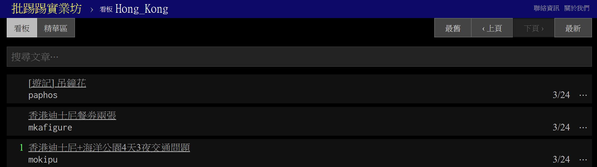

# Iterating Async Operations in Sequence

I had this problem when I was trying to grab the information from different pages of PTT webBBS although this issue may also happen on other websites that present the information with many subpages.

This implementation requires the following modules.

```js
const rp = require('request-promise');
const cheerio = require('cheerio');
```

``request`` is defined as a peer-dependency and thus has to be installed separately.

```
npm install --save request
npm install --save request-promise
npm install cheerio
```
The original ``request`` supports both streaming and callback interfaces natively. If you'd like ``request`` to return a Promise instead, you can use an alternative interface wrapper for request. These wrappers can be useful if you prefer to work with Promises, or if you'd like to use async/await in ES2017.

- [request-promise](https://github.com/request/request-promise) (uses [Bluebird](https://github.com/petkaantonov/bluebird) Promises)
- [request-promise-native](https://github.com/request/request-promise-native) (uses native Promises)
- [request-promise-any](https://github.com/request/request-promise-any) (uses [any-promise](https://www.npmjs.com/package/any-promise) Promises)

<br>

## First Attempt

I was targeting the _Hong_Kong_ section on PTT. There is less traffic with this section so I can easily compare the execution output of my code with the real arrangement of the articles and see if the pages are processed/printed in sequence. The latest page's link is always https://www.ptt.cc/bbs/Hong_Kong/index.html. When I was doing the inspection, the link to the previous page was https://www.ptt.cc/bbs/Hong_Kong/index1401.html, and the next previous link is https://www.ptt.cc/bbs/Hong_Kong/index1400.html, and so on.

So, I created an array of the indices which I can iterate with to get the article pages in order.

```js
const baseURL = 'https://www.ptt.cc/bbs';
const boardName = 'Hong_Kong';
const pageIndex = [
  '', '1401', '1400', '1399', '1398', '1397', '1396', '1395', '1394', '1393'
];
```

First, I need to know how to make a GET request to the URL and get the HTML source using ``request-promise``. Here is an simple example.

```js
const rp = require('request-promise');
var cheerio = require('cheerio'); // Basically jQuery for node.js

var options = {
    uri: 'http://www.google.com',
    transform: function (body) {
        return cheerio.load(body);
    }
};

rp(options)
    .then(function ($) {
        // Process html like you would with jQuery...
    })
    .catch(function (err) {
        // Crawling failed or Cheerio choked...
    });
```

Inspect the HTML source of the webpage, and the title of an article is located in the following section:

```html
  <div class="r-ent">
    <div class="nrec"></div>
    <div class="title">

      <a href="/bbs/Hong_Kong/M.1553430808.A.668.html">[遊記] 吊鐘花</a>

    </div>
    <div class="meta">
      <div class="author">paphos</div>
      <div class="article-menu">

        <div class="trigger">&#x22ef;</div>
        <div class="dropdown">
          <div class="item"><a
              href="/bbs/Hong_Kong/search?q=thread%3A%5B%E9%81%8A%E8%A8%98%5D&#43;%E5%90%8A%E9%90%98%E8%8A%B1">搜尋同標題文章</a>
          </div>

          <div class="item"><a href="/bbs/Hong_Kong/search?q=author%3Apaphos">搜尋看板內 paphos 的文章</a></div>

        </div>

      </div>
      <div class="date"> 3/24</div>
      <div class="mark"></div>
    </div>
  </div>
```


To get the first line of titles on the latest page of _Hong_Kong_ section, the code looks like:

```js
function transform(body) {
  return cheerio.load(body);
}

// https://www.ptt.cc/bbs/Hong_Kong/index.html
const uri = `${baseURL}/${boardName}/index.html`;
console.log(uri);

const options = {
  uri,
  transform
};

rp(options)
  .then($ => {
    const titles = $('.title a');  // All titles that match the selector
    console.log($(titles[0]).text()); // Print the first title
  })
  .catch(err => console.log(err));
```

**Result**

```
https://www.ptt.cc/bbs/Hong_Kong/index.html
[遊記] 吊鐘花
```

Compare the result with the webpage, and it was correct.



<br>

## Adding Iteration

Now, let's iterate the pages with the indices in the array ``pageIndex``. 

Adding the loop to our code:

```js
const baseURL = 'https://www.ptt.cc/bbs';
const boardName = 'Hong_Kong';
const pageIndex = [
  '', '1401', '1400', '1399', '1398', '1397', '1396', '1395', '1394', '1393'
];

function transform(body) {
  return cheerio.load(body);
}

for (const index of pageIndex) {
  // https://www.ptt.cc/bbs/Hong_Kong/index1401.html
  const uri = `${baseURL}/${boardName}/index${index}.html`;
  console.log(uri); // Print the page link

  const options = {
    uri,
    transform
  };

  // Aync operation here
  rp(options)
    .then($ => {
      const titles = $('.title a');
      console.log($(titles[0]).text()); // Print the title
    })
    .catch(err => console.log(err));
}
```

**Result**

```
https://www.ptt.cc/bbs/Hong_Kong/index.html
https://www.ptt.cc/bbs/Hong_Kong/index1401.html
https://www.ptt.cc/bbs/Hong_Kong/index1400.html
https://www.ptt.cc/bbs/Hong_Kong/index1399.html
https://www.ptt.cc/bbs/Hong_Kong/index1398.html
https://www.ptt.cc/bbs/Hong_Kong/index1397.html
https://www.ptt.cc/bbs/Hong_Kong/index1396.html
https://www.ptt.cc/bbs/Hong_Kong/index1395.html
https://www.ptt.cc/bbs/Hong_Kong/index1394.html
https://www.ptt.cc/bbs/Hong_Kong/index1393.html
[請益]關於Big bus搭乘問題
[心得] 黃道益活絡油買多了...
[行程] 請問傳說中迪士尼公主星級卡
[心得] 贈送KKDAY SIM卡剩五G
[新聞] 港人哀嘆！香港擬定新條例：侮辱中國國歌
[食記] 香港麥當勞 X 謝霆鋒「鋒味」聯名漢堡
[徵求] 過期的海洋公園門票一張
[住宿] 香港 登臺酒店 Hotel Stage–極簡無印風
[遊記] 吊鐘花
R:[問題]迪士尼餐卷及用餐問題
```

We can see that all the links had been printed out before the titles were retrieved, meaning each loop did not wait for the asynchronous operations (request-promise) to finish and continued to the next round. The request took much longer than the ``consloe.log`` statements so results all came out together after the links -- by the time at least one of the titles was printed, all link printing had been processed already.

Another interesting thing is that everytime I run the program, the order of the titles is different, which is another proof that the asynchronous operations act individually and do not wait wait for the others -- They are competing with one another.

```
https://www.ptt.cc/bbs/Hong_Kong/index.html
https://www.ptt.cc/bbs/Hong_Kong/index1401.html
https://www.ptt.cc/bbs/Hong_Kong/index1400.html
https://www.ptt.cc/bbs/Hong_Kong/index1399.html
https://www.ptt.cc/bbs/Hong_Kong/index1398.html
https://www.ptt.cc/bbs/Hong_Kong/index1397.html
https://www.ptt.cc/bbs/Hong_Kong/index1396.html
https://www.ptt.cc/bbs/Hong_Kong/index1395.html
https://www.ptt.cc/bbs/Hong_Kong/index1394.html
https://www.ptt.cc/bbs/Hong_Kong/index1393.html
[行程] 請問傳說中迪士尼公主星級卡
[食記] 香港麥當勞 X 謝霆鋒「鋒味」聯名漢堡
[新聞] 港人哀嘆！香港擬定新條例：侮辱中國國歌
[住宿] 香港 登臺酒店 Hotel Stage–極簡無印風
[遊記] 吊鐘花
[徵求] 過期的海洋公園門票一張
[請益]關於Big bus搭乘問題
[心得] 黃道益活絡油買多了...
R:[問題]迪士尼餐卷及用餐問題
[心得] 贈送KKDAY SIM卡剩五G
```

From above result, we can see that the links are still in order because the manipulating the array in the memory is a synchronous operation.

<br>

## Understanding How Promise Works

### Creating a Delay using Promise

Let's understand how **Promise** works by implementing a delay in JavaScript.

First, create a function that executes the delay with **Promise**. In the following code, the new Promise will generate a ``resolve`` (we ignore the ``reject`` here) which is a function that will be passed to the ``setTimeout`` function and fired after a period of time, which means it will take a certain amount of time for the **Promise** to tell you that it has been "resolved". 

Only when the ``resolve`` is fired (or an operation is resolved) can the ``delay`` function return the Promise. This is why the function can "delay" a specied amount of time.

```js
function delay(sec) {
  return new Promise(resolve => {
    setTimeout(resolve, sec * 1000)
  });
}
```

Then we create an **async** function ``execDelay`` that calls the ``delay`` function. Since the ``delay`` function returns a **Promise**, we should **await** it.

```js
async function execDelay() {
  console.log('Hello');
  await delay(3);
}

execDelay();
```

The result will be seeing the 'Hello' string and then wait for three seconds and finish the execution. That proved the delay did work.

### Combine the Delay with a For Loop

Wrap the ``delay`` function with a for-loop and put the for-loop inside the async ``execDelay`` function.

```js
async function execDelay() {
  for (let i = 0; i < 3; i++) {
    console.log('Hello');
    await delay(1);
  }
}

execDelay();
```

We can see that each loop waits for one second before the next 'Hello' string is printed.

```
λ node promise_delay.js
Hello
Hello
Hello
```

Now, we have figured out how to ensure that every **asynchronous operation** is completed for each loop **before** it goes to the next round with a **Promise**.

<br>

## Wrapping the For Loop with Async Function

In the preivous example, we have leanrt that to implement a delayed for-loop, we need to

- **await** the asynchronous operation, and
- wrap the for-loop with an **async** function.

The new code looks like:

```js
// Wrap the for-loop with async function
async function getTitles() {
  for (const index of pageIndex) {
    const uri = `${baseURL}/${boardName}/index${index}.html`;
    console.log(uri);
    const options = {
      uri,
      transform
    };

    // Await the aync operation here
    await rp(options)
      .then($ => {
        const titles = $('.title a');
        console.log($(titles[0]).text());
      })
      .catch(err => console.log(err));
  }
}

getTitles();
```

The for-loop is now working as expected. From the result, we can see that the title is printed next to the corresponding page link, and all the titles are also processed in sequence as the array.

```
https://www.ptt.cc/bbs/Hong_Kong/index.html
[遊記] 吊鐘花
https://www.ptt.cc/bbs/Hong_Kong/index1401.html
[食記] 香港麥當勞 X 謝霆鋒「鋒味」聯名漢堡
https://www.ptt.cc/bbs/Hong_Kong/index1400.html
[心得] 贈送KKDAY SIM卡剩五G
https://www.ptt.cc/bbs/Hong_Kong/index1399.html
[徵求] 過期的海洋公園門票一張
https://www.ptt.cc/bbs/Hong_Kong/index1398.html
[行程] 請問傳說中迪士尼公主星級卡
https://www.ptt.cc/bbs/Hong_Kong/index1397.html
[請益]關於Big bus搭乘問題
https://www.ptt.cc/bbs/Hong_Kong/index1396.html
[心得] 黃道益活絡油買多了...
https://www.ptt.cc/bbs/Hong_Kong/index1395.html
[住宿] 香港 登臺酒店 Hotel Stage–極簡無印風
https://www.ptt.cc/bbs/Hong_Kong/index1394.html
[新聞] 港人哀嘆！香港擬定新條例：侮辱中國國歌
https://www.ptt.cc/bbs/Hong_Kong/index1393.html
R:[問題]迪士尼餐卷及用餐問題
```

The overall source code:

```js
const rp = require('request-promise');
const cheerio = require('cheerio');

const baseURL = 'https://www.ptt.cc/bbs';
const boardName = 'Hong_Kong';
const pageIndex = [
  '', '1401', '1400', '1399', '1398', '1397', '1396', '1395', '1394', '1393'
];

function transform(body) {
  return cheerio.load(body);
}

async function getTitles() {
  for (const index of pageIndex) {
    const uri = `${baseURL}/${boardName}/index${index}.html`;
    console.log(uri);

    const options = {
      uri,
      transform
    };

    await rp(options)
      .then($ => {
        const titles = $('.title a');
        console.log($(titles[0]).text());
      })
      .catch(err => console.log(err));
  }
}

getTitles();
```